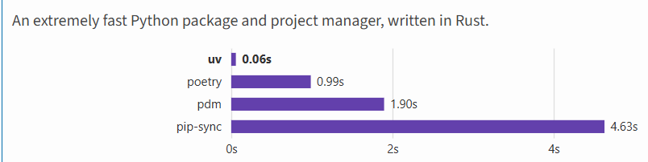
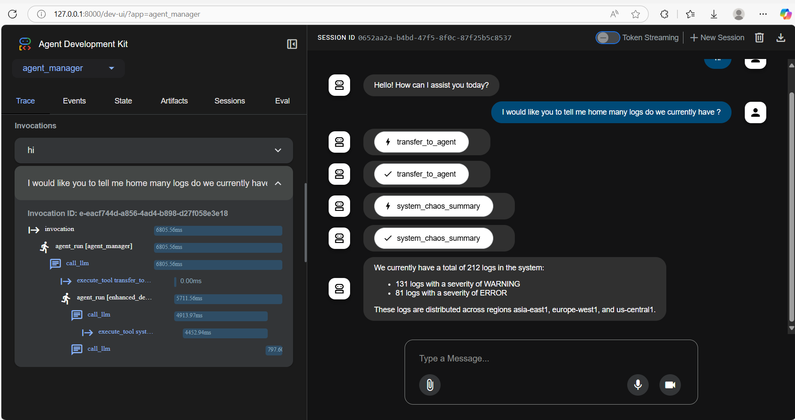

# ChaosPilot – AI-Powered Log Analysis Platform

> **Modern, full-stack AI platform for automated log analysis, incident classification, and intelligent remediation.**

---

[🚀 Quick Start](QUICK_START.md) | [📖 Setup Guide](docs/setup-and-deployment/HOW_TO_RUN_AND_DEPLOY_THE_APPLICATION.md) | [🔧 ADK Integration](docs/setup-and-deployment/ADK_INTEGRATION_README.md) | [🧪 Test Integration](test_adk_integration.py)

---

## 🎯 What is ChaosPilot?

ChaosPilot is an intelligent log analysis platform that uses AI agents to automatically analyze error, warning, and critical logs, detect patterns, classify incidents, and recommend fixes.  
**We manage the chaos of production errors through intelligent log analysis.**

---

## 🏆 Features

- **🔍 AI-Powered Analysis:** LLMs analyze logs for patterns and anomalies
- **📊 Incident Classification:** Auto-classifies by severity, impact, urgency
- **📋 Smart Response Planning:** Generates actionable response plans
- **🛠️ Automated Fix Recommendations:** Suggests and executes safe fixes
- **⚡ Safe Auto-Fixing:** Automated fixes with rollback capability
- **📢 Smart Alerting:** Intelligent notifications and escalations
- **📈 Real-Time Dashboard:** Live metrics, workflow visualization, and insights

---

## 🏗️ Architecture

| Layer      | Tech/Tools                                      |
|------------|-------------------------------------------------|
| Frontend   | Angular, TypeScript, TailwindCSS, RxJS          |
| Backend    | Python, FastAPI, Google ADK, async/await        |
| Auth       | Supabase (user/session management)              |
| Data/AI    | Google ADK agents, BigQuery, LLMs               |
| DevOps     | Docker, GCP, `uv`, `hatch`                      |

---

## 🚀 Quick Start

### Prerequisites

- [Google Cloud CLI](https://cloud.google.com/sdk/docs/install-sdk)
- [Python 3.9+](https://wiki.python.org/moin/BeginnersGuide/Download)
- [Uv](https://pypi.org/project/uv/) - 🚀 A single tool to replace pip, pip-tools, pipx, poetry, pyenv, twine, virtualenv, and more.
   >
- [Node.js 16+](https://nodejs.org/)
- [MCP Toolbox for Databases](https://googleapis.github.io/genai-toolbox/getting-started/local_quickstart/)

### Setup

1. **Clone the repository**
   ```bash
   git clone https://github.com/pmutua/ChaosPilot
   cd ChaosPilot
   ```

2. **Create and activate a Python virtual environment**

   - Create virtual environment
      ```bash

      uv venv

      ```

   - Activate virtual  environment

      ```bash

      # Linux/macOS:

      source .venv/bin/activate

      # Windows 

      .venv\Scripts\activate


      ```


3. **Install dependencies**
   ```bash
   uv sync
   ```
4. **Rename  `.env.template` to  `.env` and add relevant environment variables:**
   ```env
   APP_NAME="agent_manager"
   VERSION=0.0.0
   MODEL=""

   # If you are using Google  Gemini use this
   GOOGLE_GENAI_USE_VERTEXAI=FALSE
   GOOGLE_API_KEY=PASTE_YOUR_ACTUAL_API_KEY_HERE

   # If you are using Azure Open AI use this
   AZURE_API_KEY="add api key"
   AZURE_API_BASE=https://example.openai.azure.com/
   AZURE_API_VERSION="2025-05-05-preview"
   ```

5. **Set up Google Cloud, BigQuery, and MCP Toolbox**  
   (See [Setup Guide](docs/setup-and-deployment/HOW_TO_RUN_AND_DEPLOY_THE_APPLICATION.md) for full details.)

---

## 🖥️ Running the Application

### Start All Services

```bash
# Start MCP Toolbox
cd mcp-toolbox

toolbox --tools-file="tools.yaml"

# Start ADK API Server (with CORS)

cd ../agent_manager

adk api_server  --allow_origins="*"


# or in root directory run: 

adk api_server agent_manager --allow_origins="*"

# Start Frontend
cd ../web
npm install
npm start

```

## Debugging with Agent Development Kit  UI


Simply run the following command:


```bash

adk web

# And navigate to port 8000. Now you can interact with the Agents and debug.

```

> **NOTE:** Make sure that you select "agent_manager" on "Select Agent" option.


---



## 📚 Documentation

- [Setup & Deployment Guide](docs/setup-and-deployment/HOW_TO_RUN_AND_DEPLOY_THE_APPLICATION.md)

---

## 📊 Usage Examples

### Analyze Error Logs

1. Go to the Log Analysis page
2. Select the "Log Analyzer" agent
3. Provide error logs or describe the issue
4. Get AI-powered analysis with confidence scores

### Get Fix Recommendations

1. Use the "Fix Recommender" agent
2. Share the analyzed logs and issues
3. Get specific fix suggestions with implementation steps

### Automated Incident Response

1. System detects critical issues
2. AI agents generate response plans
3. Safe automated fixes are applied
4. Teams are notified with detailed reports

---


## 🚀 Production Deployment

See [Setup & Deployment Guide](docs/setup-and-deployment/HOW_TO_RUN_AND_DEPLOY_THE_APPLICATION.md) for GCP/Cloud Run instructions.

---

## 🔧 Troubleshooting

- **CORS Errors:** Use `adk api_server app --allow_origins="*"`
- **Service Account Issues:** Run the IAM role assignment scripts
- **Billing Errors:** Ensure GCP billing is enabled
- **Agent Not Found:** Verify you're running from the correct directory

---

## 🤝 Contributing

1. Fork the repository
2. Create a feature branch
3. Make your changes
4. Add tests if applicable
5. Submit a pull request

---

## 📄 License

MIT License – see the LICENSE file for details.

---

## 🆘 Support

- Create an issue in the repository
- Check the [documentation](docs/setup-and-deployment/)
- Review the [troubleshooting guide](docs/setup-and-deployment/HOW_TO_RUN_AND_DEPLOY_THE_APPLICATION.md#-troubleshooting)

---

**ChaosPilot** – Managing the chaos of production errors through AI-powered log analysis.
