# 🚀 ChaosPilot — Intelligent Chaos Resilience, Automated

What if your infrastructure could detect real failures, plan recoveries, and coordinate responses — all without human micromanagement?

**ChaosPilot** is a next-gen, multi-agent orchestration framework purpose-built for SRE, platform, and DevOps teams. It transforms chaos engineering telemetry and system health signals into structured recovery plans, scoped tasks, and risk-aware fix recommendations — all powered by specialized AI agents working in a strict sequence.

## ✅  What ChaosPilot Does

- 📉 **Detects Only Real Failures** – `detector_agent`
Analyzes chaos logs and system telemetry to identify genuine, system-impacting failures. Filters out non-critical issues such as test artifacts or agent-side noise. Errors are classified by **severity**, **region**, and **failure type** for downstream processing.

- 📋 **Plans Based on Confidence and Context** – `planner_agent`
Generates structured **recovery plans** using chaos event data and system health signals. Includes **confidence scores**, **immediate recovery actions**, and **long-term resilience strategies**. Planning is context-aware, based on historical trends and system impact.

- 🛠️ **Translates Plans into Executable Tasks** – `action_recommender`
Breaks down recovery plans into **clear, actionable tasks**. Defines task urgency, technical scope, estimated time, and step-by-step instructions. Each task is assigned to the appropriate team or automation system for execution readiness.

- 🧩 **Advises Safe, Risk-Aware Fixes** – `fixer_agent`
Evaluates each task for **safety**, **risk level**, and **ambiguity**. Recommends safe-to-execute actions and **escalates** high-risk or unclear fixes. Focuses on **risk mitigation** without performing execution directly.

- 📣 **Communicates in Human Language** – `notifier_agent`
Transforms structured task outcomes and fix recommendations into **human-readable alerts**. Suitable for delivery via Slack, dashboards, paging systems, or email. Messages include **urgency**, **risk level**, and **next-step summaries** tailored for operators and SRE teams.

---

### 🔬 Local Simulation (Proof of Concept)

ChaosPilot currently runs on a **simulated environment using SQLite**, enabling rapid prototyping and testing.

> 💡 **Planned Integrations (Not Yet Implemented):**

- Google BigQuery  
- Snowflake  
- Amazon Athena  
- OpenTelemetry pipelines  
- Any SQL-compatible observability datastore  

These are part of the future roadmap to support real-world scale and data ingestion across modern production environments.

> **"Let ChaosPilot be your observability sidekick — smarter decisions, faster recoveries, zero firefighting fatigue."**


## Video Demo

## Demo Work flow (under the hood)

```mermaid

flowchart TD
    %% Style Classes
    classDef source fill:#E8F5E9,stroke:#2E7D32,color:#1B5E20,stroke-width:2px;
    classDef futureSource fill:#FFFDE7,stroke:#FBC02D,color:#F57F17,stroke-dasharray: 5 5,stroke-width:2px;
    classDef core fill:#E3F2FD,stroke:#1976D2,color:#0D47A1,stroke-width:2px;
    classDef agent fill:#FCE4EC,stroke:#C2185B,color:#880E4F,stroke-width:2px;
    classDef agent2 fill:#E8EAF6,stroke:#303F9F,color:#1A237E,stroke-width:2px;

    %% Data Sources
    subgraph "📥 Data Sources"
        SQLite["🪵 SQLite (Simulated Logs)"]
        BigQuery["📊 BigQuery (Planned)"]
        Redshift["🧊 Redshift (Planned)"]
        Snowflake["❄️ Snowflake (Planned)"]
    end
    class SQLite source;
    class BigQuery,Redshift,Snowflake futureSource;

    %% Orchestration Layer
    Start["🧠 Root Orchestrator Agent\n(Delegates Each Phase in Sequence)"]
    class Start core;

    %% Agents
    Detector["📉 detector_agent\nDetects System-Only Failures\n✔ Groups by Severity/Type/Region"]
    Planner["📋 planner_agent\nPlans Recovery + Confidence Score\n✔ Suggests Short/Long-Term Actions"]
    Recommender["🛠️ action_recommender\nBreaks Plan into Recovery Tasks\n✔ Adds Urgency, Scope, Team"]
    Fixer["🧩 fixer_agent\nApproves Safe Fixes Only\n✔ Escalates Unclear or High-Risk Tasks"]
    Notifier["📣 notifier_agent\nFormats Human-Friendly Alerts\n✔ Adds Risk, Impact, Steps"]
    class Detector,Planner,Recommender,Fixer,Notifier agent;

    %% Data Flow
    SQLite --> Start
    BigQuery -. Planned .-> Start
    Redshift -. Planned .-> Start
    Snowflake -. Planned .-> Start

    Start --> Detector
    Detector --> Planner
    Planner --> Recommender
    Recommender --> Fixer
    Fixer --> Notifier

    %% Final Output
    Notifier -->|📬 Notification Stream| Output["📨 Dashboards / Slack / Email"]
    class Output agent2;

```



---

### ✅ Why This System Matters

This agent-driven system provides more than automation — it delivers **resilient, explainable recovery workflows** built on real-time chaos and observability data. Key benefits include:

- ⚡ **Reduces Mean Time to Resolution (MTTR)**  
  Automated analysis and planning help teams respond faster to real system issues — not just surface noise.

- 📊 **Keeps Incident Response Data-Driven**  
  Every recommendation is backed by structured logs, telemetry, and confidence scores — not guesswork.

- ♻️ **Repeatable and Explainable**  
  All recovery actions and decisions follow a transparent agent sequence — from detection to fix — making the process auditable and reviewable.

- 🧠 **Minimizes Cognitive Load for SRE/DevOps Teams**  
  Clear, scoped tasks eliminate the burden of manual triage during high-stress chaos events.

- 📝 **Maintains a Full Audit Trail**  
  Each stage — from failure detection to final recommendation — is traceable and versioned for compliance and root cause analysis.

This system ensures **safe, confident recovery** in high-availability environments — especially where uptime and human clarity matter most.

---

## Key Features

### ⚙️ Flow Overview: Agent Roles

| 🧩 Phase                        | 🧠 Agent              | 📝 Role                                                                                               |
|-------------------------------|----------------------|--------------------------------------------------------------------------------------------------------|
| ✅ Initial Analysis            | `detector_agent`     | Scans chaos logs and telemetry to detect real system-impacting errors, ignoring simulation noise.     |
| 🧠 Recovery Planning           | `planner_agent`      | Creates structured recovery plans with urgency, long-term strategies, and confidence scoring.         |
| 🛠 Task Generation             | `action_recommender` | Translates the recovery plan into concrete tasks with steps, teams, urgency, and execution details.   |
| ⚙️ Safety & Escalation Review | `fixer_agent`        | Evaluates tasks for safety and clarity, recommends execution or escalates based on risk assessment.   |
| 📣 Human Notification         | `notifier_agent`     | Converts task and plan summaries into human-readable alerts for Slack, dashboards, or escalation.|

---

## ✅ Real-World Scenarios

These examples demonstrate how the ChaosPilot agents work in sequence to detect, plan, and recommend recovery actions—automatically or with human oversight.

### ✅ Scenario 1: Unexpected Instance Crash

**What happens:**

- A Cloud SQL instance crashes unexpectedly at **2:00 AM**.
- `detector_agent` identifies the outage within **3 minutes** via chaos logs and telemetry.
- `planner_agent` processes the event and determines:
  > "This is a production database with a 5-minute downtime threshold." → High priority recovery required.
- `action_recommender` scopes the solution:
  > Restore from the latest backup.
- `fixer_agent` approves the task:
  > Backup verified, low risk. Safe for auto-execution.
- `notifier_agent` sends a human-friendly Slack message:
  > ✅ **Service restored automatically. Full recovery report available.**

**🟩 Outcome:**  
SRE team wakes up to a fully recovered service with a generated incident report — no manual action needed.

---

### 🚨 Scenario 2: Maintenance Gone Wrong

**What happens:**

- A schema update during a night deployment corrupts key data.
- `detector_agent` detects repeated `"corrupt table header"` messages with `ERROR` severity.
- `planner_agent` flags the situation as **critical**, recommends rollback evaluation.
- `action_recommender` outlines options:
  > Restore backup or initiate failover to standby instance.
- `fixer_agent` escalates:
  > Risk is moderate; corruption depth unknown. Human review required.
- `notifier_agent` generates a Slack alert:
  > 🚨 **Manual intervention required**. Data corruption detected. Suggested actions included.

**🟧 Outcome:**  
Human SREs are alerted early with actionable steps and system context — triage begins immediately.

---

### ⚙️ Scenario 3: Latency Spike in One Zone

**What happens:**

- System health metrics show high response latency in `europe-west1`.
- `detector_agent` identifies recurring `disk_stall` errors tied to I/O bottlenecks.
- `planner_agent` links the issue to infrastructure degradation.
- `action_recommender` generates a recovery task:
  > Shift traffic from `europe-west1` to a healthy zone.
- `fixer_agent` validates:
  > Zone health confirmed. Task is low-risk, safe to execute.
- `notifier_agent` publishes a dashboard and email notification:
  > ℹ️ **Traffic rerouted from `europe-west1`. Latency back to normal.**

**🟩 Outcome:**  
Traffic shift was executed safely, minimizing user disruption without waking the on-call team.

---

## 💼 Business Impact

### 🛠️ Platform & SRE Teams

- **Improved SLA Compliance** – Faster, automated recoveries reduce downtime and SLA breaches.
- **Reduced Pager Fatigue** – Fewer false positives thanks to smart filtering of chaos vs. real incidents.
- **Actionable Playbooks** – Clear, step-by-step recovery tasks improve operational clarity.

### 💰 Finance & Cost Optimization

- **Lower Cloud Spend** – Prevents unnecessary over-provisioning with data-backed risk analysis.
- **Predictable Recovery Costs** – Fix recommendations include estimated effort and impact.

### 🔐 Security & Compliance

- **Audit-Ready Logging** – All decisions and actions are traceable via structured logs and human-readable messages.
- **Transparent Workflows** – Each agent's decision is explainable and policy-aligned.

---

## Project Structure

```markdown

**No Data Exposure:**

- Gemini only sees metadata (no customer data)

- All secrets in Secret Manager

---

## 8. Project Structure

```markdown

```

---

See [GCP Setup Guide](docs/GCP_SETUP.md) for configuration instructions.

---

## 🏃 Running ChaosPilot Locally (All Services)


uv sync (install dependencies)

uv run adk api_server agent_manager --allow_origins="*"

uv run adk web --port 8501  playground

uv run mcp-toolbox/tool.exe

linting
	uv run codespell
	uv run ruff check . --diff
	uv run ruff format . --check --diff
	uv run mypy .


front end 

npm --prefix web run start

# Run a code quality check
uv run ruff check .

You can run the entire stack (MCP Toolbox, backend, and frontend) locally for development or demo purposes. Below are both manual and script-based instructions for Windows and Linux/Mac.

### **Manual Run (All Platforms)**

1. **Start MCP Toolbox**
   - Windows: `app\mcp-toolbox\toolbox.exe`
   - Linux/Mac/WSL: `./app/mcp-toolbox/toolbox.exe`

2. **Start Backend (ADK Agent/FastAPI)**
   - `uv run adk api_server app --allow_origins="*"`

3. **Start Frontend (Angular)**
   - `npm --prefix frontend run start`

> **Tip:** Always start MCP Toolbox first, then backend, then frontend.

---

### **One-Click Script (Recommended)**

#### **Windows**
- Use the batch script:
  ```bat
  scripts\run-all.bat
  ```
  - Double-click or run from terminal. This will open three windows for MCP Toolbox, backend, and frontend.

#### **Linux/Mac/WSL**
- Use the bash script:
  ```sh
  chmod +x scripts/run-all.sh
  ./scripts/run-all.sh
  ```
  - This will start all services in the background and wait for them.

---

### **Troubleshooting**
- If MCP Toolbox does not start, check:
  - The path to `toolbox.exe` is correct.
  - You have permission to run executables.
  - No other process is using port 5000.
  - Run `toolbox.exe` directly to see any error messages.
- If you have issues with Python dependencies:
  - Run `uv lock` (first time only) then `uv sync --frozen`.
- If you have issues with Node.js dependencies:
  - Run `npm --prefix frontend install`.

---

### **Summary Table**

| Service         | Command (Windows)                        | Command (Linux/Mac/WSL)                |
|-----------------|------------------------------------------|----------------------------------------|
| MCP Toolbox     | `app\mcp-toolbox\toolbox.exe`           | `./app/mcp-toolbox/toolbox.exe`        |
| Backend         | `uv run adk api_server app --allow_origins="*"` | `uv run adk api_server app --allow_origins="*"` |
| Frontend        | `npm --prefix frontend run start`         | `npm --prefix frontend run start`      |

---

For more details, see the scripts in the `scripts/` directory or ask for troubleshooting help!
