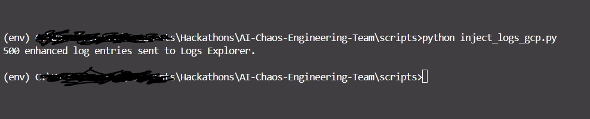

# Setup & Running the application

This document explains how to set up and run the application, as well as how to deploy it.

## ✅ Prerequisites

1. **Google Cloud CLI** [https://cloud.google.com/sdk/docs/install-sdk](https://cloud.google.com/sdk/docs/install-sdk)

2. **Python**
    - **Python Libraries Needed:**
        - `google-adk==1.3.0`
        - `toolbox==1.11.0`
        - `google-cloud-logging==3.12.1`

3. [MCP Toolbox for Databases](https://googleapis.github.io/genai-toolbox/getting-started/local_quickstart/) based on your operating system.

---

## ✅ 1. Setup GCP

1. **Install the Google Cloud CLI** [https://cloud.google.com/sdk/docs/install-sdk](https://cloud.google.com/sdk/docs/install-sdk)
2. **Initialize and Authenticate**

    ```bash
    gcloud init
    ```

    This will:

    - Log in to your Google account

    - Choose a project or create one

    - Set default region, zone, etc.

    You can also set a project manually:

    ```bash
    
    gcloud config set project [PROJECT_ID]

    ```

3. **Set Up Project & Permissions**
    - 📁 **Step 1:** Create or Use an Existing GCP Project
        - **If creating a new project:**
            `gcloud projects create chaos-lab --set-as-default`

        - **If using an existing project, set it as the default:**
            `gcloud config set project YOUR_PROJECT_ID`

    - 💳 **Step 2:** Enable Required APIs & Billing
        You must enable the necessary APIs and ensure billing is enabled on the project.

        - ✅ GCP Services, Reasons, and Permissions

            | ✅ Service             | 🧠 Why You Need It                                  | 📛 API Name                       | 🔐 Minimum IAM Role(s)                                                 |
            | --------------------- | --------------------------------------------------- | --------------------------------- | ---------------------------------------------------------------------- |
            | **Cloud Run**         | Deploy and manage serverless apps                   | `run.googleapis.com`              | `roles/run.developer`, `roles/run.invoker`                             |
            | **Cloud Build**       | Build and deploy containers to Cloud Run            | `cloudbuild.googleapis.com`       | `roles/cloudbuild.builds.editor` or inherited from Cloud Run Developer |
            | **Artifact Registry** | Store and retrieve container images for deployments | `artifactregistry.googleapis.com` | `roles/artifactregistry.reader` (or higher depending on use)           |
            | **Cloud Logging**     | Write and view logs                                 | `logging.googleapis.com`          | `roles/logging.logWriter`, `roles/logging.viewer`                      |
            | **BigQuery**          | Export and analyze logs                             | `bigquery.googleapis.com`         | `roles/bigquery.dataEditor`, `roles/bigquery.user`                     |
            | **Secret Manager**    | Store API keys, credentials securely                | `secretmanager.googleapis.com`    | `roles/secretmanager.admin`                                            |
            | **IAM**               | Create and use service accounts                     | `iam.googleapis.com`              | `roles/iam.serviceAccountCreator`, `roles/iam.serviceAccountUser`      |
            | **Service Usage**     | Enable and manage GCP services via CLI              | `serviceusage.googleapis.com`     | `roles/serviceusage.serviceUsageAdmin`                                 |

             - ✅ **Setup Services & Required IAM Roles**

                - 🔹 **1. Cloud Logging API (logging.googleapis.com)**

                    | Task                                                         | Required Role                                         |
                    | ------------------------------------------------------------ | ----------------------------------------------------- |
                    | **Write logs** (e.g. from a script, app, or service account) | `roles/logging.logWriter`                             |
                    | **View logs in Logs Explorer**                               | `roles/logging.viewer`                                |
                    | **Manage sinks, log-based metrics**                         | `roles/logging.admin`                                 |
                    | **Export logs to BigQuery / PubSub / GCS**                   | `roles/logging.configWriter` or `roles/logging.admin` |

                - 🔹 **2. BigQuery API (bigquery.googleapis.com)**

                    | Task                           | Required Role                                                        |
                    | ------------------------------ | -------------------------------------------------------------------- |
                    | **Read data**                  | `roles/bigquery.dataViewer`                                          |
                    | **Query tables**               | `roles/bigquery.user` or `roles/bigquery.jobUser` (for running jobs) |
                    | **Write data / create tables** | `roles/bigquery.dataEditor`                                          |
                    | **Administer datasets/tables** | `roles/bigquery.dataOwner` or `roles/bigquery.admin`                 |
                    | **View metadata only**         | `roles/bigquery.metadataViewer`                                      |

                    >🔐 Notes
                        Use roles/bigquery.jobUser if your app runs queries but doesn’t need to manage resources.
                        roles/bigquery.dataOwner is often used at the dataset level, not project level.
                        For fine-grained control, consider using dataset-level permissions via bq CLI or IAM policy bindings on dataset resources.
                    >💡 For exporting logs to BigQuery, the Cloud Logging sink needs roles/bigquery.dataEditor on the target dataset.

                - 🔹 **3.   Cloud Run (run.googleapis.com)**

                    | Task                                     | Required Role                        |
                    | ---------------------------------------- | ------------------------------------ |
                    | **Deploy services**                      | `roles/run.admin`                    |
                    | **Invoke services** (public or internal) | `roles/run.invoker`                  |
                    | **View services**                        | `roles/viewer` or `roles/run.viewer` |
                    | **Manage all Cloud Run resources**       | `roles/editor` or `roles/run.admin`  |

                    >⚠️ Note: roles/run.invoker is assigned at the service level, not project level — so you use gcloud run services add-iam-policy-binding for it.

                - **I created a bash script and a bat script for creating the IAM roles** files are located under the [`scripts/`](../../scripts/) folder.

                    - 📁 **assign_iam_roles.bat — Windows (CMD)**

                        ```bat

                            @echo off
                            SET PROJECT_ID=aceti-462716
                            SET SERVICE_ACCOUNT_NAME=cloud-run-svc
                            SET SERVICE_ACCOUNT_EMAIL=%SERVICE_ACCOUNT_NAME%@%PROJECT_ID%.iam.gserviceaccount.com

                            echo Enabling required GCP services...
                            gcloud services enable ^
                                logging.googleapis.com ^
                                bigquery.googleapis.com ^
                                run.googleapis.com ^
                                cloudbuild.googleapis.com ^
                                artifactregistry.googleapis.com ^
                                iam.googleapis.com ^
                                secretmanager.googleapis.com

                            echo Creating service account: %SERVICE_ACCOUNT_NAME%
                            gcloud iam service-accounts create %SERVICE_ACCOUNT_NAME% ^
                                --project=%PROJECT_ID% ^
                                --display-name="Cloud Run Logging Service Account"

                            echo Granting IAM roles to: %SERVICE_ACCOUNT_EMAIL%

                            REM Allow deployment to Cloud Run
                            gcloud projects add-iam-policy-binding %PROJECT_ID% ^
                                --member="serviceAccount:%SERVICE_ACCOUNT_EMAIL%" ^
                                --role="roles/run.developer"

                            REM Allow log writing to Cloud Logging
                            gcloud projects add-iam-policy-binding %PROJECT_ID% ^
                                --member="serviceAccount:%SERVICE_ACCOUNT_EMAIL%" ^
                                --role="roles/logging.logWriter"

                            REM Allow access to Secret Manager
                            gcloud projects add-iam-policy-binding %PROJECT_ID% ^
                                --member="serviceAccount:%SERVICE_ACCOUNT_EMAIL%" ^
                                --role="roles/secretmanager.secretAccessor"

                            REM Allow writing logs to BigQuery via sink
                            gcloud projects add-iam-policy-binding %PROJECT_ID% ^
                                --member="serviceAccount:%SERVICE_ACCOUNT_EMAIL%" ^
                                --role="roles/bigquery.dataEditor"

                            REM Allow this service account to be used by other services
                            gcloud projects add-iam-policy-binding %PROJECT_ID% ^
                                --member="serviceAccount:%SERVICE_ACCOUNT_EMAIL%" ^
                                --role="roles/iam.serviceAccountUser"

                            echo.
                            echo ✅ Setup complete.
                            echo You can now deploy your Cloud Run service using:
                            echo.
                            echo gcloud run deploy [YOUR_SERVICE_NAME] ^
                                --image=gcr.io/%PROJECT_ID%/[YOUR_IMAGE] ^
                                --region=us-central1 ^
                                --platform=managed ^
                                --service-account=%SERVICE_ACCOUNT_EMAIL% ^
                                --allow-unauthenticated ^
                                --project=%PROJECT_ID%
                            echo.
                            pause


                        ```

                        >🔁 Be sure to replace my-project-id with your actual GCP project ID before running.
                    - 📁 **assign_iam_roles.sh — Linux/macOS/Bash/WSL**

                        ```bash

                            #!/bin/bash

                            set -e

                            # Set variables
                            PROJECT_ID=$(gcloud config get-value project)
                            SERVICE_ACCOUNT_NAME="cloud-run-svc"
                            SERVICE_ACCOUNT_EMAIL="$SERVICE_ACCOUNT_NAME@$PROJECT_ID.iam.gserviceaccount.com"

                            echo "🔧 Enabling required services..."
                            gcloud services enable \
                                logging.googleapis.com \
                                bigquery.googleapis.com \
                                run.googleapis.com \
                                cloudbuild.googleapis.com \
                                artifactregistry.googleapis.com \
                                iam.googleapis.com \
                                secretmanager.googleapis.com

                            echo "👤 Creating service account: $SERVICE_ACCOUNT_NAME"
                            gcloud iam service-accounts create $SERVICE_ACCOUNT_NAME \
                                --project=$PROJECT_ID \
                                --display-name="Cloud Run Logging Service Account" || echo "ℹ️ Service account already exists."

                            echo "🔐 Granting IAM roles to $SERVICE_ACCOUNT_EMAIL..."

                            # Allow deployment to Cloud Run
                            gcloud projects add-iam-policy-binding $PROJECT_ID \
                                --member="serviceAccount:$SERVICE_ACCOUNT_EMAIL" \
                                --role="roles/run.developer"

                            # Allow Cloud Run service to write logs
                            gcloud projects add-iam-policy-binding $PROJECT_ID \
                                --member="serviceAccount:$SERVICE_ACCOUNT_EMAIL" \
                                --role="roles/logging.logWriter"

                            # Allow access to Secret Manager
                            gcloud projects add-iam-policy-binding $PROJECT_ID \
                                --member="serviceAccount:$SERVICE_ACCOUNT_EMAIL" \
                                --role="roles/secretmanager.secretAccessor"

                            # Allow BigQuery sink write access
                            gcloud projects add-iam-policy-binding $PROJECT_ID \
                                --member="serviceAccount:$SERVICE_ACCOUNT_EMAIL" \
                                --role="roles/bigquery.dataEditor"

                            # Allow querying BigQuery
                            gcloud projects add-iam-policy-binding $PROJECT_ID \
                                --member="serviceAccount:$SERVICE_ACCOUNT_EMAIL" \
                                --role="roles/bigquery.jobUser"

                            # Allow the service account to be used
                            gcloud projects add-iam-policy-binding $PROJECT_ID \
                                --member="serviceAccount:$SERVICE_ACCOUNT_EMAIL" \
                                --role="roles/iam.serviceAccountUser"

                            echo "✅ Setup complete."
                            echo "You can now deploy to Cloud Run using:"
                            echo
                            echo "gcloud run deploy [YOUR_SERVICE_NAME] \\"
                            echo "  --image=gcr.io/$PROJECT_ID/[YOUR_IMAGE] \\"
                            echo "  --region=us-central1 \\"
                            echo "  --platform=managed \\"
                            echo "  --service-account=$SERVICE_ACCOUNT_EMAIL \\"
                            echo "  --allow-unauthenticated \\"
                            echo "  --project=$PROJECT_ID"


                        ```

                        - ✅ **How to Run**

                            | Script                 | Environment          | How to Run                                                   |
                            | ---------------------- | -------------------- | ------------------------------------------------------------ |
                            | `assign_iam_roles.bat` | Windows CMD          | Run: `assign_iam_roles.bat`                            |
                            | `assign_iam_roles.sh`  | Linux/macOS/WSL/Bash | Run: `chmod +x assign_iam_roles.sh && ./assign_iam_roles.sh` |

                        🔐 **Tip**

                        - Assign roles/run.admin for full deploy/manage.

                        - Use roles/run.invoker on a per-service basis.

                        - Grant allUsers invoker only if you want public access (no auth required)

                        - ✅ **What You Should Do If you get this error:**

                            

                            **This means that either:**

                            >The service name you’re trying to enable is invalid or malformed (likely due to a typo like a stray \), OR
                            The authenticated account (email) does not have permission to enable services in the selected project.

                            - ✅ **How to Fix It**

                                 - 🔹 **You might get this error if billing account not added. Biiling must be enabled for activation of service(s).**

                                    >🔐 Make sure your billing account is linked to the project. If not, you’ll get errors like permission denied or service not enabled or `FAILED_PRECONDITION` error.

                            - ✅ **1. Check if Services Are Enabled**

                                ```bash

                                gcloud services list --enabled

                                ```

                                You will see the following list:

                                

                        - ✅ **2. Check if Billing Is Enabled**
                            In the terminal run this to check if billing is enabled on the current project:
                            `gcloud beta billing projects describe [PROJECT_ID]`

                            **Look for:**
                            `billingEnabled: true`

                            - **If you don't have a billing account attached to your GCP project**

                            - ✅ **To Add a Billing Account to a Project**
                                - 🔹 Step 1: Ensure You Have the Right IAM Role

                                    To attach a billing account, your user must have one of the following roles on the billing account:

                                    | Role                   | Role ID                | Needed For                                    |
                                    | ---------------------- | ---------------------- | --------------------------------------------- |
                                    | Billing Account User   | `roles/billing.user`   | View + link billing accounts to projects      |
                                    | Billing Account Admin  | `roles/billing.admin`  | Full access to billing account, including IAM |
                                    | Billing Account Viewer | `roles/billing.viewer` | View-only; cannot link projects               |

                                - 🔹 Step 2: Add Your Account as a Principal on the Billing Account

                                    You can do this in the **Google Cloud Console**:

                                    - Go to: [Billing](https://console.cloud.google.com/billing)

                                    - Click on the **Billing account name** you want to use or create one.
                                    - Click **"Add Principal"**
                                        - Principal: <yourusername@example.com>
                                        - Role: `Billing Account User` (or `Billing Account Administrator` if you need full control)
                                            
                                    - Click Save
                                    - ✅ Fix: Ensure Billing is Properly Linked to the Project

                                        - 🔹 **Step 1: Confirm Billing Is Linked**

                                            ```bash
                                            gcloud beta billing projects describe [PROJECT_ID]
                                            
                                            ```

                                            ✅ Expected Output:

                                            ```bash

                                            billingAccountName: billingAccounts/01A234-BCDE56-789GH7
                                            billingEnabled: true


                                            ```

                                            If `billingEnabled: false` or no `billingAccountName` is shown → billing is not linked properly.

                                        - 🔹 **Step 2: Link the Billing Account**

                                            - If not linked, do this:

                                                ```bash

                                                gcloud beta billing accounts list


                                                ```

                                                Copy the `ACCOUNT_ID` (e.g., `01A234-BCDE56-789GH7`)

                                            - **Then link it:**

                                                ```bash

                                                gcloud beta billing projects link [PROJECT_ID] \
                                                    --billing-account=01A234-BCDE56-789GH7

                                                ```

                                                

                                                **Confirm again with:**
                                                `gcloud beta billing projects describe [PROJECT_ID]
                                        - 🔹 Step 3: Try Enabling the Services Again

                                            ```bash

                                            gcloud services enable logging.googleapis.com bigquery.googleapis.com run.googleapis.com


                                            ```

                                            

---

## ✅ 2. Installing and running the project

1. **Git clone the project on your local machine:**

    ```bash

    git clone https://github.com/pmutua/ChaosPilot

    ```

2. Using the terminal, navigate to the parent folder `ChaosPilot` (e.g. using cd ..)

    ```bash
    cd ChaosPilot
    ```

3. **Installation**

    - **Create & activate virtual environment**

        I recommend creating a virtual Python environment using [venv](https://docs.python.org/3/library/venv.html):

        ```bash

        python -m venv .venv

        ```

        Now, you can activate the virtual environment using the appropriate command for your operating system and environment:

        ```bash

        # Mac / Linux
        source .venv/bin/activate

        # Windows CMD:
        .venv\Scripts\activate.bat

        # Windows PowerShell:
        .venv\Scripts\Activate.ps1

        ```

    - MCP Toolbox for Databases
        Depending on your operating system you should change this file [toolbox.exe](../../mcp-toolbox/toolbox.exe) or leave as is if you are using windows. [Check this tutorial it will help you with setting up.](https://codelabs.developers.google.com/mcp-toolbox-bigquery-dataset#5)

4. **Running the Agent**
    - Using the terminal, change directory to `manager/` and run the agent:
        > **NOTE:** **There are multiple ways to interact with your agent:**
        1. Run the following command to launch the dev UI.

            ```bash
            adk web

            ```

            - **Step 1:** Open the URL provided (usually <http://localhost:8000> or http://127.0.0.1:8000) directly in your browser.

            - **Step 2:** In the top-left corner of the UI, you can select your agent in the dropdown. Select "manager".

            >Troubleshooting: If you do not see "manager" in the dropdown menu, make sure you are running adk web in the parent folder of your agent folder (i.e. the parent folder of manager which is "ChaosPilot").
            - **Step 3:** Run the [MCP Toolbox for Databases](https://googleapis.github.io/genai-toolbox/getting-started/introduction/). Using terminal change directory to "mcp-toolbox" then run the following command:

                ```bash
                
                # Windows

                toolbox

                # Linux or Mac Os

                ./toolbox --tools-file="tools.yaml"

                ```

                You should see the server is running:
                

            - **Step 4:** Now you can chat with your agent using the textbox:
                

        2. **or** Run the following command, to chat with the agent.

            > **NOTE:** make sure you run "mcp-toolbox"
            - Run the following command:

                ```bash
                adk run manager

                ```

                You should see the following:

                

        3. **or** `adk api_server` enables you to create a local FastAPI server in a single command, enabling you to test local cURL requests before you deploy your agent.
            > **NOTE:** make sure you run "mcp-toolbox" as we did when running dev UI.
            - Run the following command:

                ```bash

                adk api_server

                ```

            To learn how to use adk api_server for testing, refer to the [documentation on testing](https://google.github.io/adk-docs/get-started/testing/).

            You should see the server running as follows:
            

---

## ✅ 3. Logs Simulation

For testing purposes and to demonstrate the proof of concept, I generated fake logs and wrote them to the **GCP Logging** service. This was necessary because, under normal circumstances, logs are generated automatically when services are running. In our case, since no services were actively producing logs, I simulated error logs so they would appear in the Logs Explorer. From there, I was able to create a sink to BigQuery, allowing us to build a data source pipeline for use with **ChaosPilot**.

**ChaosPilot** uses its agents to aggregate key metrics, analyze the data using LLMs, and generate actionable insights.

>**Note:** This setup was for testing only. If your GCP environment already has active services generating logs visible in the **Logs Explorer**, you can directly create a sink to **BigQuery** without injecting fake logs.

To simulate logs manually, use the `inject_logs_gcp.py` script. From the root directory, run the following command:

```bash

python scripts/inject_logs_gcp.py

```



### 📊 Let's open the Log Explorer in the GCP Console to verify the injected logs

Logs have been successfully added.


Assuming we now have the logs already  available on the logging service

## 🔎 Where to View the Logs

After running the script, go to **Google Cloud Console** → **Logging** → **Logs Explorer**, and filter by:

## 📤 Exporting Error Logs to BigQuery

Once the logs are visible in **Logs Explorer**, the next step is to export only the logs that indicate errors to **BigQuery**. This allows us to build structured, scalable pipelines for deeper analysis, automation, and observability — especially when integrating with **ChaosPilot**.

### ✅ Why Export Only Error Logs?

- 🔍 **Structured Analysis**: Run SQL queries on logs to identify error patterns and root causes.

- 📊 **Dashboard Integration**: Use BigQuery as a data source for visual tools like Looker Studio or Grafana.

- ⚙️ **ChaosPilot Automation**: ChaosPilot agents can use error data to generate recovery actions and insights.

- 🕰️ **Historical Tracking**: Retain error logs long-term to analyze trends over time.

- 💸 **Cost Efficiency**: Storing only ERROR severity logs avoids unnecessary costs and keeps queries fast.

### 🛠️ How to Sink Error and Warning Logs to BigQuery (via [Log Router](https://cloud.google.com/logging/docs/export/configure_export_v2))

Follow these steps to filter and export only error logs to **BigQuery**:

1. Open Logs Explorer in the **GCP Console**
2. Go to **Log Router**
    - <https://console.cloud.google.com/logs/routing>:

3. Click “Create Sink” at the top.
    

4. Fill in the sink details:
    - Sink Name: `warnings-errors-sink`
    - Sink Destination: Choose `88BigQuery dataseT`
    - Select Dataset: Choose an existing one or create a new dataset
5. In the Build inclusion filter field, enter a filter expression that matches the log entries you want to include. To learn more about the syntax for writing filters, see [Logging query language](https://cloud.google.com/logging/docs/view/logging-query-language).
    - Click “Add a filter”
    - Enter the following **advanced filter**:

        ```text

        severity = ("ERROR" OR "WARNING")


        ```

        

6. Once results are loaded, click **“Create Sink”**

    

7. Click on See BigQuery dataset and you will be redirected to the **BigQuery** section.
    - It takes some time for dataset to be loaded be patient.

    

**If you end up getting the exception:**

>Exception calling IAM: Service account cloud-run-svc@[PROJECT_ID].iam.gserviceaccount.com does not exist.

✅ What This Means

You're trying to grant the role `roles/logging.logWriter` to a service account named:

`cloud-run-svc@[PROJECT_ID].iam.gserviceaccount.com`

But this service account doesn’t exist in your project, so the gcloud projects add-iam-policy-binding command fails.

🔧 **How to Fix It**

Go ahead and run the policy binding command again:

```bash

# Windows CMD

gcloud projects add-iam-policy-binding [PROJECT_ID] ^
--member="serviceAccount:cloud-run-svc@[PROJECT_ID].iam.gserviceaccount.com" ^
--role="roles/logging.logWriter"

# Linux or MacOs

gcloud projects add-iam-policy-binding [PROJECT_ID] \
--member="serviceAccount:cloud-run-svc@[PROJECT_ID].iam.gserviceaccount.com" \
--role="roles/logging.logWriter"


```

🧪 Optional: Verify the Service Account Exists

```python

gcloud iam service-accounts describe cloud-run-svc@[PROJECT_ID].iam.gserviceaccount.com


```

⚙️ **How a Log Sink Works (GCP → BigQuery)**

- Logs are generated by your services (e.g. Cloud Run, scripts).
- Logs go into Cloud Logging.
- The Log Router checks each new log against your sink’s filter (e.g., severity = "ERROR").
- If the log matches, it’s exported to your chosen destination — like BigQuery.
- In BigQuery, logs are stored in a table you can query and analyze.

## Deploy to Cloud Run

Run the following command

```bash

# Linux or MacOS
adk deploy cloud_run \
--project=$GOOGLE_CLOUD_PROJECT \
--region=$GOOGLE_CLOUD_LOCATION \
$AGENT_PATH

# Windows

adk deploy cloud_run ^
--project=$GOOGLE_CLOUD_PROJECT ^
--region=$GOOGLE_CLOUD_LOCATION ^
$AGENT_PATH

```
