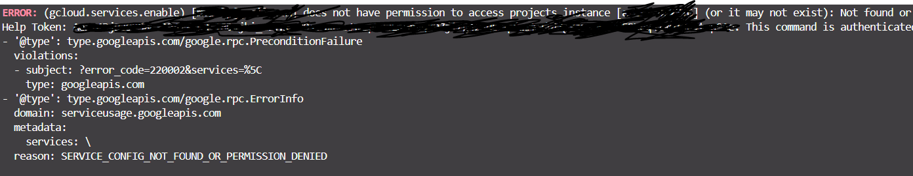
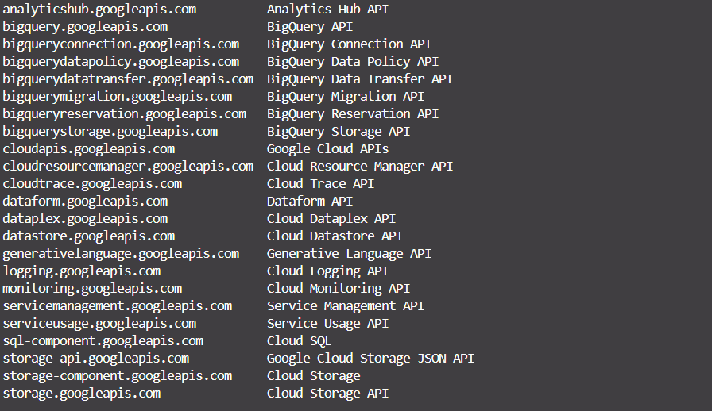
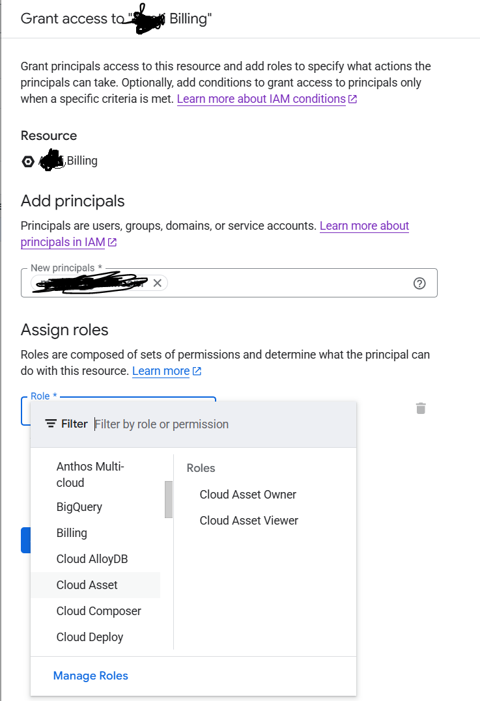
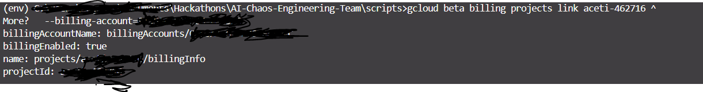
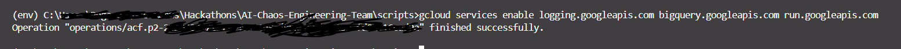
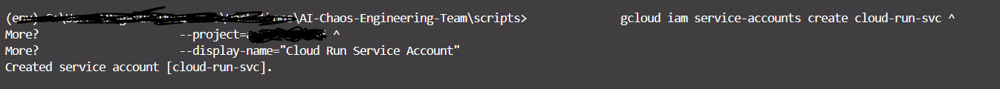
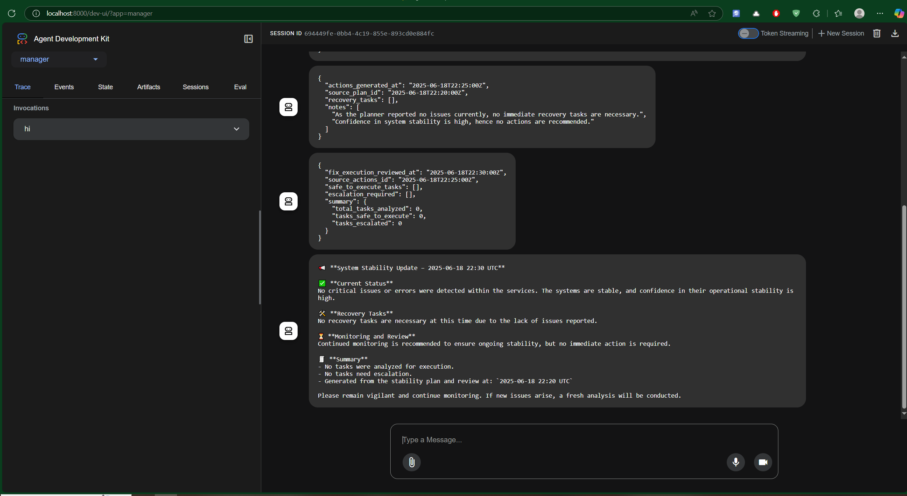
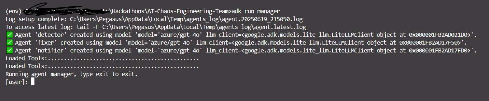
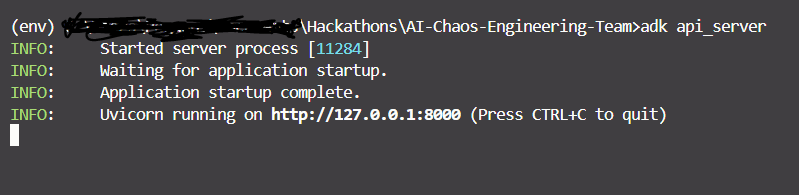

# Setup & Running the application

This document explains how to set up and run the application, as well as how to deploy it.

## ✅ Prerequisites

1. **Google Cloud CLI** [https://cloud.google.com/sdk/docs/install-sdk](https://cloud.google.com/sdk/docs/install-sdk)

2. **Python**
    - **Python Libraries Needed:**
        - `google-adk==1.3.0`
        - `toolbox==1.11.0`
        - `google-cloud-logging==3.12.1`

3. [MCP Toolbox for Databases](https://googleapis.github.io/genai-toolbox/getting-started/local_quickstart/) based on your operating system.

## ✅ 1. Setup GCP

1. **Install the Google Cloud CLI** [https://cloud.google.com/sdk/docs/install-sdk](https://cloud.google.com/sdk/docs/install-sdk)
2. **Initialize and Authenticate**

    ```bash
    gcloud init
    ```

    This will:

    - Log in to your Google account

    - Choose a project or create one

    - Set default region, zone, etc.

    You can also set a project manually:

    ```bash
    
    gcloud config set project [PROJECT_ID]

    ```

3. **Set Up Project & Permissions**
    - 📁 **Step 1:** Create or Use an Existing GCP Project
        - **If creating a new project:**
            `gcloud projects create chaos-lab --set-as-default`

        - **If using an existing project, set it as the default:**
            `gcloud config set project YOUR_PROJECT_ID`

    - 💳 **Step 2:** Enable Required APIs & Billing
        You must enable the necessary APIs and ensure billing is enabled on the project.

        - ✅ GCP Services, Reasons, and Permissions

            | ✅ Service                       | 🧠 Why You Need It                                                                  | 📛 API Name                   | 🔐 Minimum IAM Role                                                                             |
            | ------------------------------- | ----------------------------------------------------------------------------------- | ----------------------------- | ----------------------------------------------------------------------------------------------- |
            | **Cloud Run**                   | To deploy and run your serverless apps or log generation scripts (like fake logs)   | `run.googleapis.com`          | `roles/run.admin` to deploy<br>`roles/run.invoker` to call                                      |
            | **Cloud Logging**               | To write, store, and view logs in Logs Explorer (e.g., your fake logs)              | `logging.googleapis.com`      | `roles/logging.logWriter` to write<br>`roles/logging.viewer` to view                            |
            | **BigQuery**                    | To export logs from Cloud Logging to BigQuery for analysis, dashboards, or reports  | `bigquery.googleapis.com`     | `roles/bigquery.dataEditor` (for sinks)<br>`roles/bigquery.user` (for queries)                  |
            | **Cloud Monitoring** *(optional)*            | To use dashboards, uptime checks, and alerts tied to logs and system health         | `monitoring.googleapis.com`   | `roles/monitoring.metricWriter` to send metrics<br>`roles/monitoring.viewer` to view dashboards |
            | **Compute Engine** *(optional)* | Required only if you're running agents on VMs or simulating infrastructure failures | `compute.googleapis.com`      | `roles/compute.viewer` or `roles/compute.admin`                                                 |
            | **Service Usage**               | Needed to enable and manage other GCP services via CLI or automation                | `serviceusage.googleapis.com` | `roles/serviceusage.serviceUsageAdmin`                                                          |

        ✅ **What You Should Do**

        Before enabling other services via CLI or script, include this:

        `gcloud services enable serviceusage.googleapis.com`

        Then you can safely run:

        ```bash

        # Enable the core APIs your app or script depends on:
        gcloud services enable \
        logging.googleapis.com \
        bigquery.googleapis.com \
        run.googleapis.com

        # Optional: for monitoring, dashboards, uptime checks, alerts
        gcloud services enable monitoring.googleapis.com

        # Optional: for simulating infrastructure, running VMs, or agent-based testing
        gcloud services enable compute.googleapis.com

        # Only include these if your app will interact with Monitoring or Compute Engine.

        ```

        **If you get this error:**

        

        **This means that either:**

        >The service name you’re trying to enable is invalid or malformed (likely due to a typo like a stray \), OR
        The authenticated account (email) does not have permission to enable services in the selected project.

        ✅ How to Fix It

        - 🔹 **1. Check for an accidental backslash in your command**

            ```bash

            gcloud services enable \
                logging.googleapis.com \
                bigquery.googleapis.com


            ```

            Make sure the backslash (`\`) is followed immediately by a line break, with no stray space or characters afterward.

        - 🔹 **2. Check that your account has permissions**

            ```bash

            gcloud projects get-iam-policy [PROJECT_ID] \
                --flatten="bindings[].members" \
                --filter="bindings.members:user:yourusername@example.com"

            ```

        - 🔹 **3. If you are using Windows CMD (use ^ for line continuation):**

            ```bash

            gcloud services enable ^
                logging.googleapis.com ^
                bigquery.googleapis.com ^
                run.googleapis.com


            ```

        - 🔹 **4. You might get this error if billing account not added. Biiling must be enabled for activation of service(s).**

            >🔐 Make sure your billing account is linked to the project.
    If not, you’ll get errors like permission denied or service not enabled or `FAILED_PRECONDITION` error.

        - ✅ **1. Check if Services Are Enabled**

            ```bash

            gcloud services list --enabled

            ```

            You will see the following list:

            

        - ✅ **2. Check if Billing Is Enabled**
            In the terminal run this to check if billing is enabled on the current project:
            `gcloud beta billing projects describe [PROJECT_ID]`

            **Look for:**
                - `billingEnabled: true`

            Replace [PROJECT_ID] with your actual GCP project ID.

            - **If you don't have a billing account attached to your GCP project**

                - ✅ **To Add a Billing Account to a Project**
                    - 🔹 Step 1: Ensure You Have the Right IAM Role

                        To attach a billing account, your user must have one of the following roles on the billing account:

                        | Role                   | Role ID                | Needed For                                    |
                        | ---------------------- | ---------------------- | --------------------------------------------- |
                        | Billing Account User   | `roles/billing.user`   | View + link billing accounts to projects      |
                        | Billing Account Admin  | `roles/billing.admin`  | Full access to billing account, including IAM |
                        | Billing Account Viewer | `roles/billing.viewer` | View-only; cannot link projects               |

                    - 🔹 Step 2: Add Your Account as a Principal on the Billing Account

                        You can do this in the **Google Cloud Console**:

                        - Go to: [Billing](https://console.cloud.google.com/billing)

                        - Click on the **Billing account name** you want to use or create one.
                        - Click **"Add Principal"**
                            - Principal: <yourusername@example.com>
                            - Role: `Billing Account User` (or `Billing Account Administrator` if you need full control)
                                
                        - Click Save
                        - ✅ Fix: Ensure Billing is Properly Linked to the Project

                            - 🔹 **Step 1: Confirm Billing Is Linked**

                                ```bash
                                gcloud beta billing projects describe [PROJECT_ID]
                                
                                ```

                                ✅ Expected Output:

                                ```bash

                                billingAccountName: billingAccounts/01A234-BCDE56-789GH7
                                billingEnabled: true


                                ```

                                If `billingEnabled: false` or no `billingAccountName` is shown → billing is not linked properly.

                            - 🔹 **Step 2: Link the Billing Account**

                                - If not linked, do this:

                                    ```bash

                                    gcloud beta billing accounts list


                                    ```

                                    Copy the `ACCOUNT_ID` (e.g., `01A234-BCDE56-789GH7`)

                                - **Then link it:**

                                    ```bash

                                    gcloud beta billing projects link [PROJECT_ID] \
                                        --billing-account=01A234-BCDE56-789GH7

                                    ```

                                    

                                    **Confirm again with:**
                                    `gcloud beta billing projects describe [PROJECT_ID]
                            - 🔹 Step 3: Try Enabling the Services Again

                                ```bash

                                gcloud services enable logging.googleapis.com bigquery.googleapis.com run.googleapis.com


                                ```

                                

        - ✅ **Setup Services & Required IAM Roles**

            - 🔹 Create the service account first

                We will use name `cloud-run-svc`, we need to create it before assigning roles via our script:

                ```bash

                gcloud iam service-accounts create cloud-run-svc \
                    --project=[PROJECT_ID] \
                    --display-name="Cloud Run Service Account"


                ```

                

            - 🔹 **1. Cloud Logging API (logging.googleapis.com)**

                | Task                                                         | Required Role                                         |
                | ------------------------------------------------------------ | ----------------------------------------------------- |
                | **Write logs** (e.g. from a script, app, or service account) | `roles/logging.logWriter`                             |
                | **View logs in Logs Explorer**                               | `roles/logging.viewer`                                |
                | **Manage sinks, log-based metrics**                         | `roles/logging.admin`                                 |
                | **Export logs to BigQuery / PubSub / GCS**                   | `roles/logging.configWriter` or `roles/logging.admin` |

            - 🔹 **2. BigQuery API (bigquery.googleapis.com)**

                | Task                           | Required Role                                                        |
                | ------------------------------ | -------------------------------------------------------------------- |
                | **Read data**                  | `roles/bigquery.dataViewer`                                          |
                | **Query tables**               | `roles/bigquery.user` or `roles/bigquery.jobUser` (for running jobs) |
                | **Write data / create tables** | `roles/bigquery.dataEditor`                                          |
                | **Administer datasets/tables** | `roles/bigquery.dataOwner` or `roles/bigquery.admin`                 |
                | **View metadata only**         | `roles/bigquery.metadataViewer`                                      |

                >🔐 Notes
                    Use roles/bigquery.jobUser if your app runs queries but doesn’t need to manage resources.
                    roles/bigquery.dataOwner is often used at the dataset level, not project level.
                    For fine-grained control, consider using dataset-level permissions via bq CLI or IAM policy bindings on dataset resources.
                >💡 For exporting logs to BigQuery, the Cloud Logging sink needs roles/bigquery.dataEditor on the target dataset.

            - 🔹 **3.   Cloud Run (run.googleapis.com)**

                | Task                                     | Required Role                        |
                | ---------------------------------------- | ------------------------------------ |
                | **Deploy services**                      | `roles/run.admin`                    |
                | **Invoke services** (public or internal) | `roles/run.invoker`                  |
                | **View services**                        | `roles/viewer` or `roles/run.viewer` |
                | **Manage all Cloud Run resources**       | `roles/editor` or `roles/run.admin`  |

                >⚠️ Note: roles/run.invoker is assigned at the service level, not project level — so you use gcloud run services add-iam-policy-binding for it.

                - **I created a bash script and a bat script for creating the IAM roles** files are located under the [`scripts/`](../../scripts/) folder. 

                    - 📁 **assign_iam_roles.bat — Windows (CMD)**

                        ```bat

                        @echo off
                        REM ==========================================
                        REM 🛡️ Title: Assign IAM Roles for Cloud Run Service Account
                        REM 📍 Environment: Windows CMD (.bat)
                        REM 🔧 Description:
                        REM   This script assigns IAM roles to a Cloud Run service account
                        REM   so it can write logs and interact with BigQuery.
                        REM ==========================================

                        REM 🔄 Set your project ID and service account email
                        set PROJECT_ID=my-project-id
                        set SERVICE_ACCOUNT_EMAIL=cloud-run-svc@%PROJECT_ID%.iam.gserviceaccount.com

                        REM ✅ Grant permission to write logs
                        gcloud projects add-iam-policy-binding %PROJECT_ID% ^
                        --member="serviceAccount:%SERVICE_ACCOUNT_EMAIL%" ^
                        --role="roles/logging.logWriter"

                        REM ✅ Grant permission to run BigQuery jobs
                        gcloud projects add-iam-policy-binding %PROJECT_ID% ^
                        --member="serviceAccount:%SERVICE_ACCOUNT_EMAIL%" ^
                        --role="roles/bigquery.jobUser"

                        REM ✅ (Optional) Grant permission to write to BigQuery
                        gcloud projects add-iam-policy-binding %PROJECT_ID% ^
                        --member="serviceAccount:%SERVICE_ACCOUNT_EMAIL%" ^
                        --role="roles/bigquery.dataEditor"

                        pause


                        ```

                        >🔁 Be sure to replace my-project-id with your actual GCP project ID before running.
                    - 📁 **assign_iam_roles.sh — Linux/macOS/Bash/WSL**

                        ```bash

                        #!/bin/bash
                        # ==========================================
                        # 🛡️ Title: Assign IAM Roles for Cloud Run Service Account
                        # 📍 Environment: Linux, macOS, Git Bash, or WSL (.sh)
                        # 🔧 Description:
                        #   This script assigns IAM roles to a Cloud Run service account
                        #   so it can write logs and interact with BigQuery.
                        # ==========================================

                        # 🔄 Get the active project ID
                        PROJECT_ID=$(gcloud config get-value project)
                        SERVICE_ACCOUNT_EMAIL="cloud-run-svc@$PROJECT_ID.iam.gserviceaccount.com"

                        # ✅ Grant permission to write logs
                        gcloud projects add-iam-policy-binding "$PROJECT_ID" \
                        --member="serviceAccount:$SERVICE_ACCOUNT_EMAIL" \
                        --role="roles/logging.logWriter"

                        # ✅ Grant permission to run BigQuery jobs
                        gcloud projects add-iam-policy-binding "$PROJECT_ID" \
                        --member="serviceAccount:$SERVICE_ACCOUNT_EMAIL" \
                        --role="roles/bigquery.jobUser"

                        # ✅ (Optional) Grant permission to write to BigQuery
                        gcloud projects add-iam-policy-binding "$PROJECT_ID" \
                        --member="serviceAccount:$SERVICE_ACCOUNT_EMAIL" \
                        --role="roles/bigquery.dataEditor"


                        ```

            - ✅ How to Run

                | Script                 | Environment          | How to Run                                                   |
                | ---------------------- | -------------------- | ------------------------------------------------------------ |
                | `assign_iam_roles.bat` | Windows CMD          | Run: `assign_iam_roles.bat`                            |
                | `assign_iam_roles.sh`  | Linux/macOS/WSL/Bash | Run: `chmod +x assign_iam_roles.sh && ./assign_iam_roles.sh` |


            🔐 **Tip**

            - Assign roles/run.admin for full deploy/manage.

            - Use roles/run.invoker on a per-service basis.

            - Grant allUsers invoker only if you want public access (no auth required)


## ✅ 2. Installing and running the project

1. **Git clone the project on your local machine:**

    ```bash

    git clone https://github.com/pmutua/ChaosPilot

    ```

2. Using the terminal, navigate to the parent folder `ChaosPilot` (e.g. using cd ..)

    ```bash
    cd ChaosPilot
    ```

3. **Installation**

    - **Create & activate virtual environment**

        I recommend creating a virtual Python environment using [venv](https://docs.python.org/3/library/venv.html):

        ```bash

        python -m venv .venv

        ```

        Now, you can activate the virtual environment using the appropriate command for your operating system and environment:

        ```bash

        # Mac / Linux
        source .venv/bin/activate

        # Windows CMD:
        .venv\Scripts\activate.bat

        # Windows PowerShell:
        .venv\Scripts\Activate.ps1

        ```

    - MCP Toolbox for Databases
        Depending on your operating system you should change this file [toolbox.exe](../../mcp-toolbox/toolbox.exe) or leave as is if you are using windows. [Check this tutorial it will help you with setting up.](https://codelabs.developers.google.com/mcp-toolbox-bigquery-dataset#5)

4. **Running the Agent**
    - Using the terminal, change directory to `manager/` and run the agent:
        > **NOTE:** **There are multiple ways to interact with your agent:**
        1. Run the following command to launch the dev UI.

            ```bash
            adk web

            ```

            - **Step 1:** Open the URL provided (usually <http://localhost:8000> or http://127.0.0.1:8000) directly in your browser.

            - **Step 2:** In the top-left corner of the UI, you can select your agent in the dropdown. Select "manager".

            >Troubleshooting: If you do not see "manager" in the dropdown menu, make sure you are running adk web in the parent folder of your agent folder (i.e. the parent folder of manager which is "ChaosPilot").
            - **Step 3:** Run the [MCP Toolbox for Databases](https://googleapis.github.io/genai-toolbox/getting-started/introduction/). Using terminal change directory to "mcp-toolbox" then run the following command:

                ```bash
                
                # Windows

                toolbox

                # Linux or Mac Os

                ./toolbox --tools-file="tools.yaml"

                ```

                You should see the server is running:
                

            - **Step 4:** Now you can chat with your agent using the textbox:
                

        2. **or** Run the following command, to chat with the agent.

            > **NOTE:** make sure you run "mcp-toolbox"
            - Run the following command:

                ```bash
                adk run manager

                ```

                You should see the following:

                

        3. **or** `adk api_server` enables you to create a local FastAPI server in a single command, enabling you to test local cURL requests before you deploy your agent.
            > **NOTE:** make sure you run "mcp-toolbox" as we did when running dev UI.
            - Run the following command:

                ```bash

                adk api_server

                ```

            To learn how to use adk api_server for testing, refer to the [documentation on testing](https://google.github.io/adk-docs/get-started/testing/).

            You should see the server running as follows:
            

## ✅ 3. Logs Simulation

For testing purposes to show proof of concept, I had to generate fake logs and write to the logging service on GCP. The idea was to simulate error logs so they would appear in the Logs Explorer. From there, I could create a sink to BigQuery, enabling us to build a data source pipeline for use with ChaosPilot.

ChaosPilot’s role is to use its agents to aggregate specific metrics, analyze the data using LLMs, and generate insightful outputs.

> **NOTE:** This was for testing purposes but if you already have existing logs on GCP and are visible in logger explorer then you can sink the logs to big query.

If you want to simulate the logs use the [inject_logs_gcp.py](../../scripts/inject_logs_gcp.py) script by navigating in the root directory and run the following command:

```bash

python scripts/inject_logs.py

```


### 📊 Log Explorer

Assuming we now have the logs already  available on the logging service

## 🔎 Where to View the Logs

After running the script, go to Google Cloud Console → Logging → Logs Explorer, and filter by:

```sh

logName = "projects/YOUR_PROJECT_ID/logs/chaospilot-fake-logs"

```
